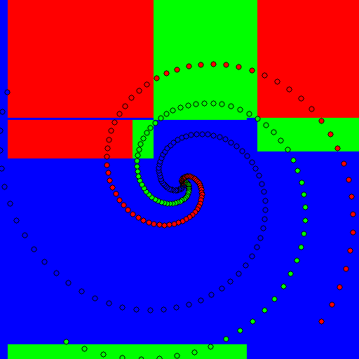

Random Ferns in Python
========================

This module is a basic implementation of Random Ferns which allows users to
define their own weak learners (the tests performed at each node).

Example
-------

These examples train on three spiral (without noise) and predict the whole
plane. They try 4 different weak learners: axis aligned, linear, conic and parabolas.

``python example_ferns.py``

Using one single fern:    

Axis aligned:    

Linear:       

Conic:          

Parabola:           

Using 50 ferns, with soft or hard decision boundaries:       

Axis aligned:       
 &nbsp; 

Linear:       
 &nbsp; 

Conic:         
 &nbsp; 

Parabola:         
 &nbsp; 

Reference
---------

M. Ozuysal, P. Fua and V. Lepetit, "Fast Keypoint Recognition in Ten Lines of Code",        
Conference on Computer Vision and Pattern Recognition, Minneapolis, MI, June 2007.        
http://cvlab.epfl.ch/software/ferns
